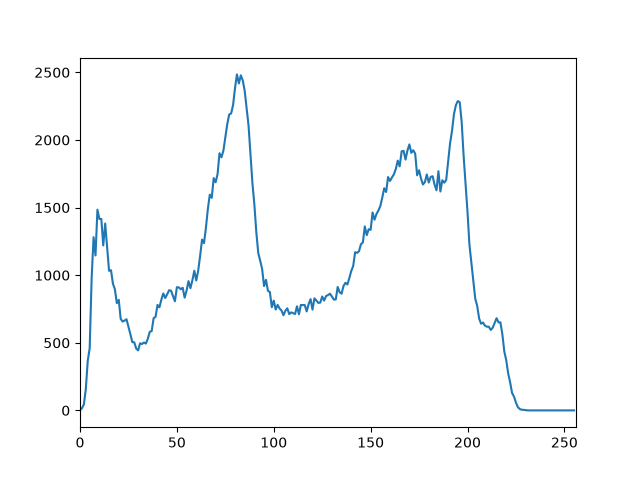

# TP1

Eloi Tourangin et Thomas Verron
SEC3

## 2 - Histogramme

### 2.1 Histogramme de l’image originale

L'image `peppers-512.png` est convertie en niveaux de gris avant le calcul de son histogramme.

L'axe horizontal représente les niveaux de gris, de 0 (noir) à 255 (blanc), et l'axe vertical représente le nombre de pixels pour chaque niveau. L'histogramme présente principalement deux zones de concentration, autour des niveaux 80 et 180, ce qui indique que l'image contient beaucoup de pixels de luminosité sombre à moyenne et claire. Les faibles valeurs aux extrémités montrent qu'il y a peu de pixels complètement noirs ou complètement blancs.

### 2.2 - Égalisation de l’histogramme
