# TP1

Eloi Tourangin et Thomas Verron
SEC3

## 2 - Histogramme

### 2.1 - Image originale

L'image `peppers-512.png` est  en niveaux de gris.

| Image originale | Histogramme original |
|:---:|:---:|
|  |  |

L'axe horizontal représente les niveaux de gris, de 0 (noir) à 255 (blanc), et l'axe vertical représente le nombre de pixels. L'histogramme présente principalement deux zones de concentration, autour des niveaux 80 et 180. Les faibles valeurs aux extrémités montrent qu'il y a peu de pixels complètement noirs ou complètement blancs.

### 2.2 - Égalisation de l'histogramme

Transformation utilisée : `cv2.equalizeHist`, sans paramètre supplémentaire.

| Image originale | Image après égalisation |
|:---:|:---:|
|  | 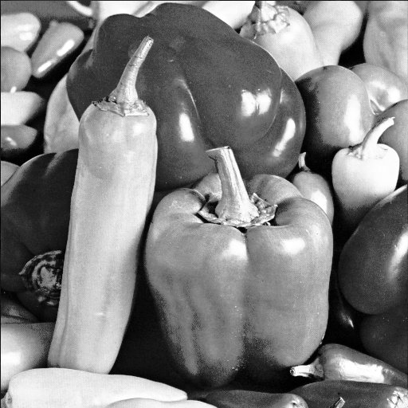 |

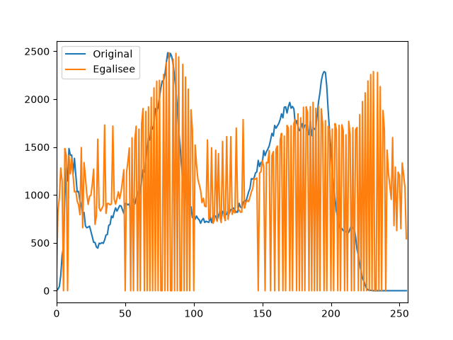

L'égalisation redistribue les niveaux de gris sur une plage plus large. L'histogramme est donc plus étalé et le contraste augmente, notamment dans les zones où les niveaux étaient initialement proches. La répartition n'est pas parfaitement uniforme, car elle dépend de l'image de départ.

### 2.3 - Modification de la luminosité et du contraste

#### Augmentation de la luminosité

Transformation utilisée : `I' = alpha * I + beta`, avec `alpha=1` et `beta=40`.

| Image originale | Image après augmentation de la luminosité |
|:---:|:---:|
|  | 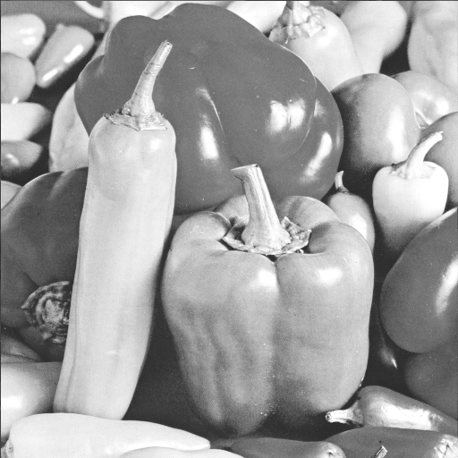 |

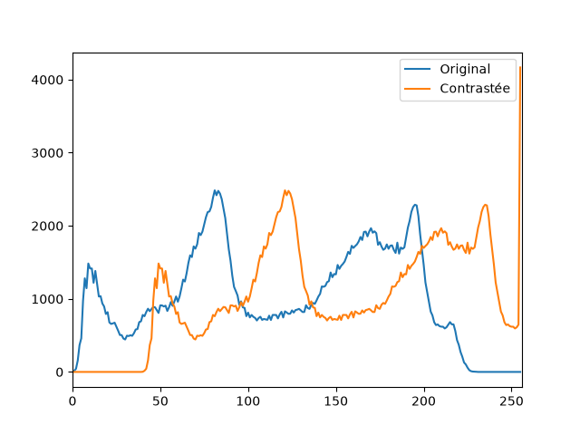

Avec `beta=40`, l'image devient globalement plus claire et l'histogramme se déplace vers les niveaux élevés. Les pixels dépassant 255 sont saturés à 255, ce qui peut supprimer des détails dans les zones très claires.

#### Augmentation du contraste

Transformation utilisée : `I' = alpha * I + beta`, avec `alpha=1.5` et `beta=0`.

| Image originale | Image après augmentation du contraste |
|:---:|:---:|
|  | 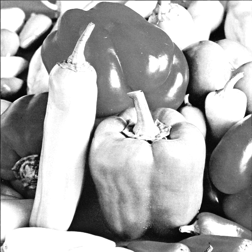 |

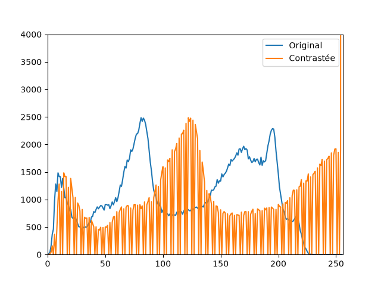

Avec `alpha=1.5`, les zones sombres deviennent plus sombres et les zones claires plus claires. L'histogramme s'étale autour de la moyenne. Les valeurs hors de `[0,255]` sont tronquées, ce qui peut provoquer une saturation dans les deux extrêmes.

## 3 - Redimensionnement d’image

### 3.1 - Sous-échantillonnage

On réduit `peppers-256.png` en 64×64 (facteur 4) avec trois méthodes.

La fonction `sous_echantillonner` parcourt l'image de sortie avec une double boucle et garde le pixel en haut à gauche de chaque bloc 4×4 :

```python
def sous_echantillonner(image, facteur):
    nh, nw = image.shape[0] // facteur, image.shape[1] // facteur
    nouvelle = np.zeros((nh, nw), dtype=np.uint8)
    for i in range(nh):
        for j in range(nw):
            nouvelle[i, j] = image[i * facteur, j * facteur]
    return nouvelle
```

| Originale (256×256) | Double boucle | `INTER_NEAREST` | `INTER_AREA` |
|:---:|:---:|:---:|:---:|
|  |  |  |  |

**Pourquoi un pixel par bloc de 4×4 ?**
On passe de 256 à 64 pixels par côté, soit un facteur 4. Chaque pixel de l'image réduite correspond donc à un bloc de 4×4 pixels de l'originale.

**Comparaison des méthodes**
La double boucle et `INTER_NEAREST` donnent le même résultat : on ne garde qu'un pixel par bloc, donc les contours sont crénelés et certains petits détails disparaissent ou sont déformés (aliasing). `INTER_AREA` fait la moyenne de chaque bloc : l'image est plus lisse et plus fidèle, mais un peu plus floue.

### 3.2 - Sur-échantillonnage

On agrandit `peppers-128.png` en 512×512 (facteur 4) avec `INTER_NEAREST` et `INTER_LINEAR`.

```python
img128 = cv2.imread("peppers-128.png", cv2.IMREAD_GRAYSCALE)
img_nearest = cv2.resize(img128, (512, 512), interpolation=cv2.INTER_NEAREST)
img_linear  = cv2.resize(img128, (512, 512), interpolation=cv2.INTER_LINEAR)
```

| Plus proche voisin (512×512) | Bilinéaire (512×512) |
|:---:|:---:|
|  |  |

**Plus proche voisin vs bilinéaire**
Avec le plus proche voisin, chaque pixel est recopié en un bloc 4×4 : l'image est pixelisée et les contours sont en escalier. Avec le bilinéaire, les transitions sont progressives : plus de blocs visibles, mais l'image est floue, surtout sur les contours.

**L'agrandissement permet-il de retrouver des détails ?**
Non. Les nouveaux pixels sont calculés uniquement à partir des pixels existants, donc aucune information n'est ajoutée. L'image a plus de pixels, mais pas plus de détails que l'image 128×128.

## 4 - Quantification, LUT et plans de couleur

### 4.1 - Quantification des niveaux de gris

| Nombre de niveaux | Image quantifiée | Histogramme |
|:---:|:---:|:---:|
| 256 (original) |  |  |
| 64 | 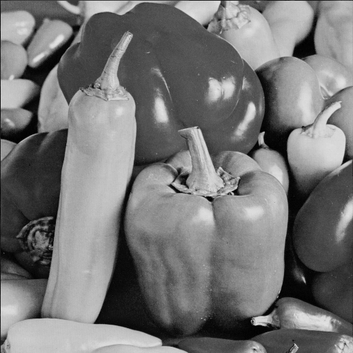 | 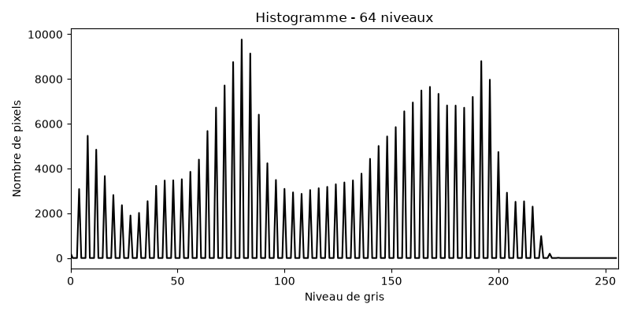 |
| 16 |  | 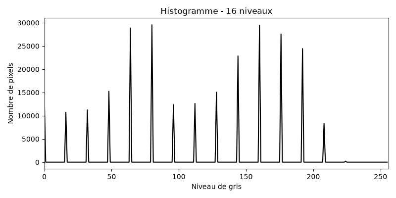 |
| 4 | 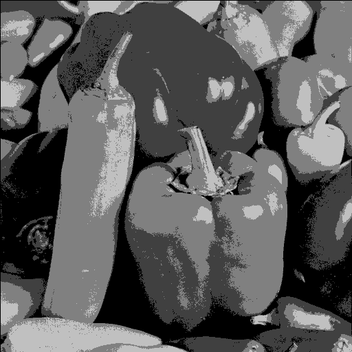 | 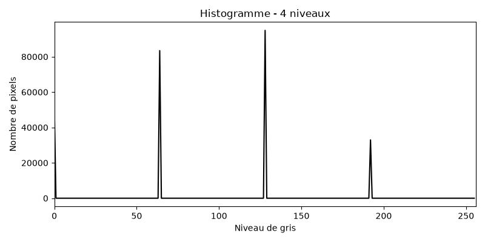 |
| 2 | 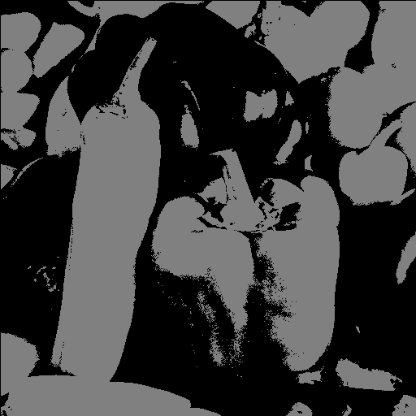 | 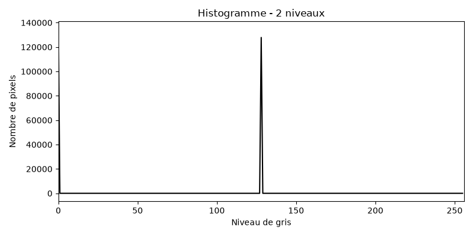 |

La quantification réduit le nombre de niveaux de gris disponibles. À mesure que le nombre de niveaux diminue, l'image devient plus plate et l'histogramme se concentre sur moins de valeurs. La perte de détail est visible dès 4 niveaux, puis devient très marquée à 2 niveaux.

### 4.2 - Application de LUT colorées

### Comparaison des images

L'image originale en niveaux de gris et les quatre representations obtenues avec `cv2.applyColorMap` sont comparees ci-dessous.

| Image en niveaux de gris | LUT JET | LUT HOT | LUT OCEAN | LUT PINK |
|:---:|:---:|:---:|:---:|:---:|
|  | 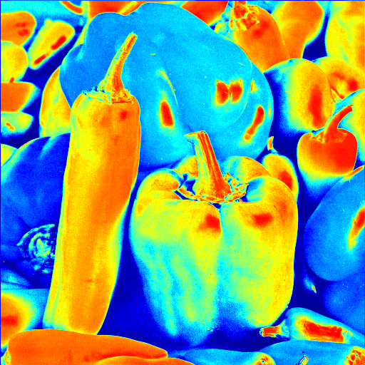 | 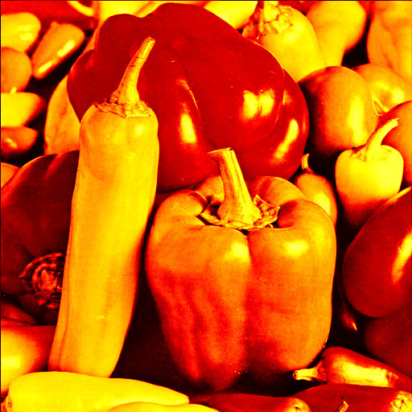 | 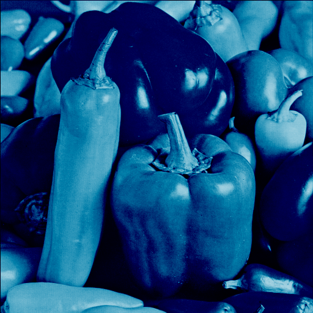 | 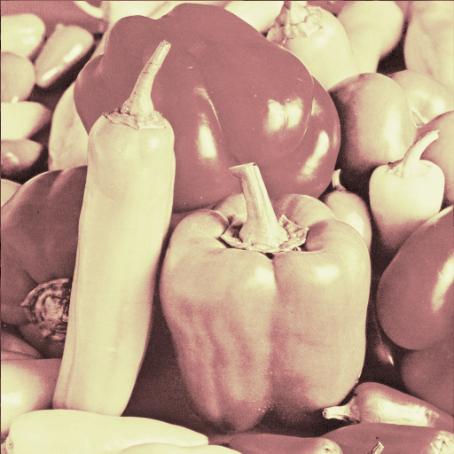 |

- `JET` va du bleu aux faibles intensites, puis au vert, au jaune et au rouge aux fortes intensites. Elle accentue fortement les contrastes, mais peut creer des frontieres visuelles artificielles.
- `HOT` va du noir au rouge, puis au jaune et au blanc. Elle met bien en evidence les fortes intensites et conserve une lecture intuitive des zones sombres.
- `OCEAN` privilegie les tons sombres, bleus et verts. Elle met bien en evidence les faibles intensites, mais differencie moins les niveaux eleves.
- `PINK` produit une progression douce vers des tons clairs et roses. Elle est lisible, mais moins contrastee chromatiquement que `JET`.

Pour cette image, `HOT` semble la LUT la plus adaptee : elle met clairement en evidence les zones lumineuses tout en conservant une progression lisible depuis les regions sombres. `JET` est plus contrastee, mais peut exagerer certaines transitions.